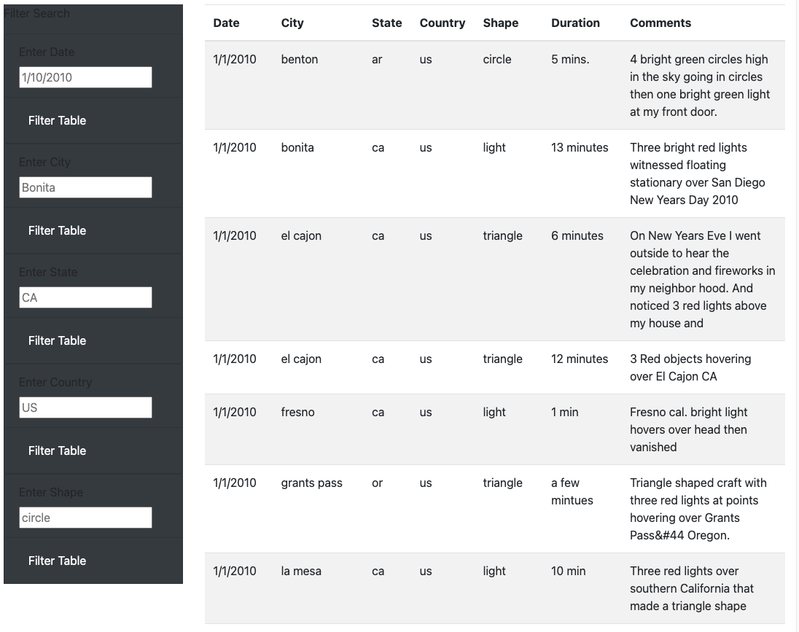

# UFOs

## Overview
- We want to create an interactable data webpage for UFO Sightings data by utilizing JavaScript and HTML. To do so we leverage:
-D3 JavaScript library
-Bootstrap & CSS Stylesheets
-JavaScript Arrow Functions
-JavaScript forEach loops
-Dynamically filtered/generated data & tables

## Results
-The result of this project is a fully functioning webpage with a full catalog of extensive UFO sightings data and 5 dynamic filters for easy navigation of said data.

-The dynamics filters filter for:
    -Date
    -City
    -State
    -Country
    -Shape

-By clicking a "Filter Table" button, users can filter and sift through data to find the UFO sightings reports that they want to see.

## Summary
- The data and site are up and operational with a system to filter data so viewers can manage what UFO Sightings data they'd like to see.
- One drawback of the webpage is that it is not dynamically collecting data through scrapes or updates, it only works from a set data list that is contained in data.js
- I would recommend integrating dynamically updating data & adding drop down menu filters for filters such as shape, country, etc to make it easier to communicate what limits the data filters have) [by this I mean that a drop down menu would communicate what states the user could filter for for example as there could be no ufo sightings that take place in X state, yet users are still able to search for it.]
